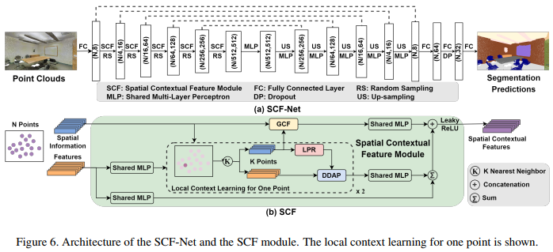
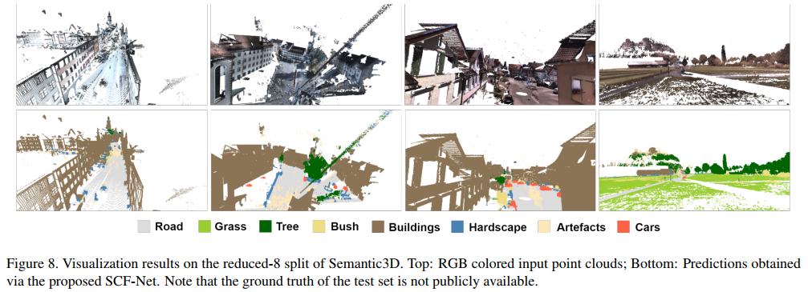

## SCF-Net: Learning Spatial Contextual Features for Large-Scale Point Cloud Segmentation



### (0) Abstract

How to learn effective features from large-scale point clouds for semantic segmentation has attracted increasing attention in recent years. Addressing this problem, we propose a learnable module that learns Spatial Contextual Features from large-scale point clouds, called SCF in this paper. The proposed module mainly consists of three blocks, including the local polar representation block, the dual-distance attentive pooling block, and the global contextual feature block. For each 3D point, the local polar representation block is firstly explored to construct a spatial representation that is invariant to the z-axis rotation, then the dual-distance attentive pooling block is designed to utilize the representations of its neighbors for learning more discriminative local features according to both the geometric and feature distances among them, and finally, the global contextual feature block is designed to learn a global context for each 3D point by utilizing its spatial location and the volume ratio of the neighborhood to the global point cloud. The proposed module could be easily embedded into various network architectures for point cloud segmentation, naturally resulting in a new 3D semantic segmentation network with an encoder-decoder architecture, called SCF-Net in this work. Extensive experimental results on two public datasets demonstrate that the proposed SCF-Net performs better than several state-of-the-art methods in most cases.


### (1) Setup

This code has been tested with Python 3.5, Tensorflow 1.11, CUDA 9.0 and cuDNN v7 on Ubuntu 16.04.

* Setup python environment
  ```
  conda create -n SCF-Net python=3.5
  source activate SCF-Net
  ```

* Clone the repository

* Install the requirements
  ```
  pip install -r requirements.txt
  sh compile_op.sh
  ```

* Download pertained models

  | Dataset                  | Pretrained Model  | 
  |--------------------------|----------------|
  | S3DIS                    | [Baidu](https://pan.baidu.com/s/1QSdXmhuJYixxYFF70No4XQ): rw6m |
  | Semantic3D               | [Baidu](https://pan.baidu.com/s/1rsbPDTUXH-4-XvDSb0K2-g): bzcz |

### (2) S3DIS


* Setup the dataset
  * Download the "Stanford3dDataset_v1.2_Aligned_Version.zip" at [S3DIS](https://docs.google.com/forms/d/e/1FAIpQLScDimvNMCGhy_rmBA2gHfDu3naktRm6A8BPwAWWDv-Uhm6Shw/viewform?c=0&w=1), and move the upcompressed folder to /data/S3DIS
  * Preparing the dataset
    ```
    python utils/s3dis_dp.py
    ```
* Training
  ```
  python s3dis_main.py --gpu 0 --mode train --test_area xxx
  ```
* Evaluation
  ```
  python s3dis_main.py --gpu 0 --mode test --test_area xxx --model_path='path_to_model'
  ```
* 6 fold cross validation
  ```
  a) train and predict
     sh s3dis_6fold.sh

  b) evaluate
     python s3dis_6fold_eval.py
  ```

### (3) Semantic3D


* Setup the dataset
  * Download the dataset
    ```
    sh utils/download_semantic3d.sh
    ```
  * Preparing the dataset
    ```
    python utils/semantic3d_dp.py
    ```
* Training
  ```
  python semantic3d_main.py --mode train --gpu 0
  ```
* Testing
  ```
  python semantic3d_main.py --mode test --gpu 0 --model_path='path_to_model'
  ```

### (4) Visualization




```
python visualization.py --dataset 'xxx' --ply_path "path_to_origin_ply" --label_path "path_to_label"
```

### Citation

If you find our work useful in your research, please consider citing:

```
@InProceedings{Fan_2021_CVPR,
    author    = {Fan, Siqi and Dong, Qiulei and Zhu, Fenghua and Lv, Yisheng and Ye, Peijun and Wang, Fei-Yue},
    title     = {SCF-Net: Learning Spatial Contextual Features for Large-Scale Point Cloud Segmentation},
    booktitle = {Proceedings of the IEEE/CVF Conference on Computer Vision and Pattern Recognition (CVPR)},
    month     = {June},
    year      = {2021},
    pages     = {14504-14513}}
```

### Acknowledgment

Part of our code refers to the work [RandLA-Net](https://github.com/QingyongHu/RandLA-Net)


